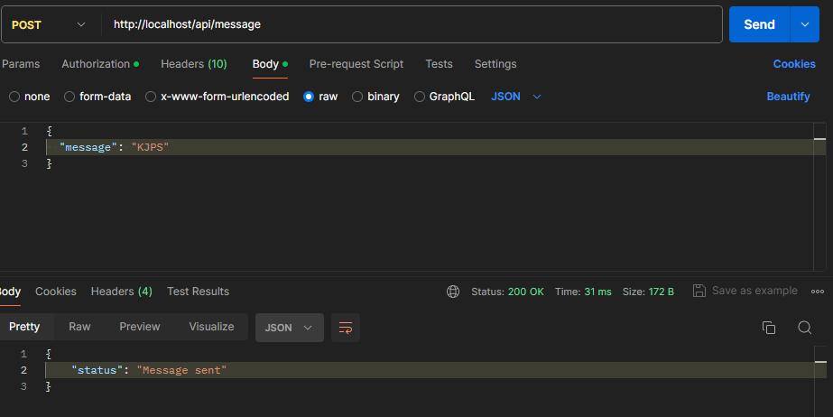
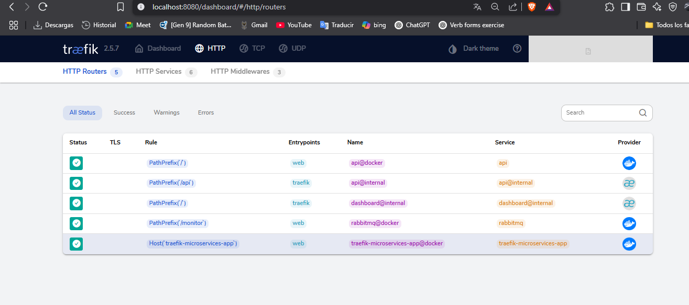

# Microservices App - Arquitectura de Microservicios con Docker, Flask, RabbitMQ y Traefik

---

## SECCIÓN 1: CONCEPTOS TEÓRICOS

### 1.1 RabbitMQ

**¿Qué es RabbitMQ?**  
RabbitMQ es un broker de mensajes para sistemas distribuidos. Permite que aplicaciones y servicios intercambien mensajes de forma asíncrona y desacoplada, facilitando la comunicación entre microservicios.

**¿Cuándo usar una cola frente a un exchange tipo fanout?**  
- **Cola (Queue):** Se usa cuando quieres que cada mensaje sea consumido por un solo consumidor.
- **Exchange tipo fanout:** Se usa cuando quieres que cada mensaje sea entregado a todos los consumidores conectados a las colas enlazadas.

**¿Qué es una Dead Letter Queue (DLQ) y cómo se configura en RabbitMQ?**  
Una DLQ es una cola especial donde se envían mensajes que no pudieron ser procesados correctamentepor razones como por rechazos o expiración.  
**Configuración básica:**  
Al crear una cola, puedes definir la propiedad `x-dead-letter-exchange` para redirigir los mensajes fallidos a otra cola específica.

---

### 1.2 Docker y Docker Compose

**Diferencia entre un volumen y un bind mount con ejemplos:**  
- **Volumen:**  
  Administrado por Docker, se almacena en `/var/lib/docker/volumes`.  
  Ejemplo en docker-compose:
  ```yaml
  volumes:
    - mi-volumen:/data
  ```
- **Bind mount:**  
  Mapea una carpeta del host a una ruta del contenedor.  
  Ejemplo:
  ```yaml
  volumes:
    - ./carpeta-local:/data
  ```

**¿Qué implica usar `network_mode: host` en un contenedor?**  
El contenedor comparte la red del host, usando sus interfaces y puertos directamente.  
- **Ventaja:** Menos demora y acceso directo a la red del host.
- **Desventaja:** Menos aislamiento es mas facil que se produzcan conflictos de puertos.

---

### 1.3 Traefik

**Función de Traefik en una arquitectura de microservicios:**  
Traefik es un balanceador de carga que enruta peticiones externas a los servicios internos de los microservicios, permitiendo descubrimiento automático, balanceo, HTTPS, y reglas de enrutamiento dinámicas.

**¿Cómo se puede asegurar un endpoint usando certificados TLS automáticos en Traefik?**  
Traefik puede obtener y renovar certificados TLS automáticamente usando Let's Encrypt.  
Ejemplo de configuración mínima en Traefik:
```yaml
entryPoints:
  websecure:
    address: ":443"

certificatesResolvers:
  letsencrypt:
    acme:
      email: tu-email@dominio.com
      storage: acme.json
      httpChallenge:
        entryPoint: web
```
Luego, en las etiquetas del servicio:
```yaml
labels:
  - "traefik.http.routers.mi-servicio.entrypoints=websecure"
  - "traefik.http.routers.mi-servicio.tls.certresolver=letsencrypt"
```
Esto asegura el endpoint con HTTPS usando certificados automáticos.

---

## SECCIÓN 2: DESARROLLO PRACTICO
## Servicios

### 1. API Service (Flask)
- **Ruta principal:** `/api/message` (POST)
- **Funcionalidad:**  
  Recibe un JSON vía POST, lo publica en la cola `messages` de RabbitMQ.  
  El endpoint está protegido con autenticación básica (usuario y contraseña configurables por variables de entorno).
- **Endpoint de salud:** `/api/health` (GET)

### 2. Worker Service (Python)
- **Funcionalidad:**  
  Escucha la cola `messages` en RabbitMQ y escribe cada mensaje recibido en el archivo `data/messages.log` (persistente gracias a un volumen Docker).
- **Logs:**  
  Los mensajes procesados se muestran en los logs del contenedor y se almacenan en el archivo mencionado.

### 3. RabbitMQ
- **Funcionalidad:**  
  Broker de mensajes para la comunicación entre la API y el worker.
- **Interfaz web:**  
  Accesible a través de Traefik en `/monitor` (usuario/contraseña por defecto: `guest`/`guest`).

### 4. Traefik (Reverse Proxy)
- **Funcionalidad:**  
  Reverse proxy que enruta:
  - `/api` → Servicio API Flask
  - `localhost:15672` → Interfaz web de RabbitMQ
- **Panel de administración de Traefik:**  
  Accesible en `http://localhost:8080` (opcional, para monitoreo de rutas y servicios).

---

## ¿Cómo funciona el flujo?

1. **El usuario envía un POST a `/api/message` con autenticación básica.**
2. **La API publica el mensaje en la cola `messages` de RabbitMQ.**
3. **El worker consume los mensajes de la cola y los guarda en `data/messages.log`.**
4. **Puedes monitorear el estado de la API con `/api/health` y ver la interfaz de RabbitMQ en `localhost:15672`.**

---

## ¿Cómo funciona el flujo? (Ejemplo paso a paso)

1. **Envía un mensaje a la API**
   
   Puedes hacerlo con Postman o desde la terminal con este comando:
   ```sh
   curl -X POST http://localhost/api/message \
     -u user:pass \
     -H "Content-Type: application/json" \
     -d '{"message": "Hola desde curl"}'
   ```
   Si todo está bien, recibirás:
   ```json
   {"status": "Message sent"}
   ```

2. **Verifica que el worker procese el mensaje**
   
   Consulta los logs del worker en tiempo real:
   ```sh
   docker-compose logs -f worker
   ```
   Deberías ver una línea como:
   ```
   Received message: Hola desde curl
   ```

   También puedes ver los mensajes guardados en el archivo persistente:
   ```sh
   docker-compose exec worker cat data/messages.log
   ```
   Verás tu mensaje al final del archivo.

3. **Monitorea el estado de la API**
   
   Comprueba que la API está viva con:
   ```sh
   curl http://localhost/api/health
   ```
   Respuesta esperada:
   ```json
   {"status": "healthy"}
   ```

4. **Accede a la interfaz web de RabbitMQ**
   
   Abre tu navegador y entra a:
   ```
   http://localhost:15672
   ```
   Usuario: `guest`  
   Contraseña: `guest`  
   Aquí puedes ver la cola `messages` y los mensajes que pasan por el sistema.

5. **(Opcional) Accede al dashboard de Traefik**
   
   Si quieres ver cómo Traefik enruta tus servicios, entra a:
   ```
   http://localhost:8080
   ```

---

## Cómo levantar el proyecto

1. **Clona el repositorio:**
   ```sh
   https://github.com/YesidMG/Parcial_2_distri.git
   cd microservices-app
   ```

2. **Construye y levanta los servicios:**
   ```sh
   docker-compose up --build
   ```

3. **Verifica que todos los servicios estén "Up":**
   ```sh
   docker-compose ps
   ```

---

## Cómo acceder a los servicios

### API REST (Flask)
- **Endpoint:**  
  `POST http://localhost/api/message`
- **Autenticación:**  
  Basic Auth  
  - Usuario: `user`  
  - Contraseña: `pass`
- **Body (JSON):**
  ```json
  {
    "message": "Tu mensaje aquí"
  }
  ```
- **Ejemplo de post:**

curl -X POST http://localhost/api/message \
  -u user:pass \
  -H "Content-Type: application/json" \
  -d '{"message": "Hola desde curl"}'

- **Endpoint de salud:**  
  `GET http://localhost/api/health`

### Worker
- **Logs:**  
  ```sh
  docker-compose logs -f worker
  ```
- **Mensajes procesados:**  
  ```sh
  docker-compose exec worker cat data/messages.log
  ```

### RabbitMQ (Interfaz web)
- **URL:**  
  [http://localhost/monitor](http://localhost/monitor)
- **Usuario/Contraseña:**  
  guest / guest

### Traefik (Dashboard)
- **URL:**  
  [http://localhost:8080](http://localhost:8080)

---

# Evidencias
## Envio de mensaje


## Recibimiento de mensaje


## Monitoreo de status de la appi


## Rabit MQ


## Traefick
